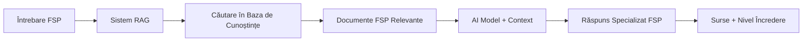

# Antrenarea AI-ului (Gemini) pe Informații Specifice despre FSP

Acest repository conține un pachet complet de resurse pentru antrenarea și customizarea AI-ului să se specializeze pe informații despre **Family Systems Perspective (FSP)** în domeniul medical.

## 📁 Conținutul Repository-ului

### 📖 Documentația Completă
- **[ghid_antrenare_ai_fsp.md](./ghid_antrenare_ai_fsp.md)** - Ghidul teoretic complet cu toate metodele și tehnicile
- **[instructiuni_implementare.md](./instructiuni_implementare.md)** - Instrucțiuni pas cu pas pentru implementare rapidă

### 💻 Codul Practic  
- **[prototip_fsp_rag.py](./prototip_fsp_rag.py)** - Implementarea completă a sistemului FSP RAG

### 📋 Acest README
- Prezentare generală și ghid de utilizare

---

## 🎯 Obiectivul Proiectului

Să creezi un asistent AI specializat care poate:
- ✅ Răspunde precis la întrebări despre FSP
- ✅ Genera cazuri medicale similare bazate pe principiile FSP  
- ✅ Explica termeni tehnici (Fachbegriffe) în context
- ✅ Oferi informații relevante pentru practicienii medicali
- ✅ Menține transparența prin afișarea surselor

---

## 🚀 Începe Rapid (Quick Start)

### 1. Citește Ghidul Teoretic
Începe cu **[ghid_antrenare_ai_fsp.md](./ghid_antrenare_ai_fsp.md)** pentru a înțelege:
- Metodele disponibile (RAG, Fine-tuning, Prompt Engineering)
- Avantajele și dezavantajele fiecărei abordări
- Arhitectura sistemului recomandat

### 2. Urmează Instrucțiunile Pas cu Pas
Folosește **[instructiuni_implementare.md](./instructiuni_implementare.md)** pentru:
- Configurarea mediului de dezvoltare
- Instalarea dependențelor
- Implementarea pas cu pas a sistemului

### 3. Rulează Prototipul
Folosește **[prototip_fsp_rag.py](./prototip_fsp_rag.py)** pentru:
- Un exemplu complet și funcțional
- Testarea rapidă a conceptelor
- Baza pentru dezvoltarea ulterioară

---

## � Comparația Metodelor

| Metodă | Complexitate | Timp Implementare | Flexibilitate | Costuri | Recomandare |
|--------|--------------|-------------------|---------------|---------|-------------|
| **RAG** | Medie | 1-2 zile | Foarte Mare | Mici | ⭐⭐⭐⭐⭐ |
| **Fine-tuning** | Mare | 1-2 săptămâni | Medie | Mari | ⭐⭐⭐ |
| **Prompt Engineering** | Mică | Câteva ore | Mică | Foarte Mici | ⭐⭐ |
| **Google AI Studio** | Mică | 1 zi | Medie | Mici | ⭐⭐⭐⭐ |

### 💡 Recomandarea Noastră: **RAG (Retrieval-Augmented Generation)**

**De ce RAG?**
- ✅ **Flexibilitate maximă**: Poți actualiza cunoștințele fără reantrenant
- ✅ **Transparență**: Afișează sursele pentru toate răspunsurile  
- ✅ **Eficiență**: Nu necesită resurse computaționale masive
- ✅ **Precizie**: Accesează informații actualizate în timp real
- ✅ **Siguranță**: Reduce riscul de halucații AI

---

## 🏗️ Arhitectura Sistemului RAG



### Componentele Principale:
1. **Baza de Cunoștințe FSP**: Documente, ghiduri, cazuri clinice
2. **Sistemul de Embedding**: Convertește textul în vectori
3. **Motorul de Căutare**: Găsește informații relevante
4. **Modelul AI**: Generează răspunsuri bazate pe context
5. **Interfața**: Web app sau API pentru interacțiune

---

## 📋 Cerințe Tehnice

### Software Necesar:
- **Python 3.8+**
- **pip** (pentru instalarea pachetelor)
- **Git** (pentru clonarea repository-ului)

### API Keys Necesare:
- **OpenAI API Key** (pentru model și embeddings)
- **Pinecone API Key** (pentru baza de date vectorială)

### Resurse Hardware Minime:
- **RAM**: 8GB+ recomandat
- **Storage**: 5GB+ pentru documente și modele
- **Internet**: Pentru accesul la API-urile cloud

---

## 📚 Resurse FSP Necesare

Pentru a antrena sistemul optim, vei avea nevoie de:

### Documente Esențiale:
- 📄 **Teoria FSP**: Principii fundamentale, concepte de bază
- 📄 **Ghiduri Clinice**: Protocoale, proceduri, standarde
- 📄 **Studii de Caz**: Exemple practice, intervenții reale
- 📄 **Glosare**: Termeni tehnici, Fachbegriffe cu explicații

### Formate Acceptate:
- **.PDF** - Cărți, articole, ghiduri
- **.TXT** - Note, transcripturi, glosare  
- **.DOCX** - Documente, rapoarte
- **.MD** - Documentație structurată

### Organizarea Documentelor:
```
fsp_documents/
├── teoria_fsp/
│   ├── principii_fundamentale.pdf
│   └── concepte_avansate.pdf
├── ghiduri_clinice/
│   ├── protocoale_interventie.pdf
│   └── standarde_practice.pdf
├── cazuri_clinice/
│   ├── studii_caz_1.pdf
│   └── studii_caz_2.pdf
└── terminologie/
    ├── glosar_fsp.txt
    └── fachbegriffe.txt
```

---

## 🎯 Funcționalități Disponibile

### 🤖 Asistentul FSP poate:

#### 1. **Răspunsuri la Întrebări Specializate**
```python
# Exemple de întrebări
"Ce este circularitatea în FSP?"
"Cum se aplică genograma în terapia familială?"
"Care sunt contraindicațiile pentru tehnica X?"
```

#### 2. **Generarea de Cazuri Medicale**
```python
# Input: Context pacient
"Familie cu adolescent cu probleme de comportament, părinți divorțați"

# Output: Caz medical structurat cu:
# - Dinamica familială
# - Strategii de intervenție FSP  
# - Termeni tehnici relevanți
# - Prognostic și obiective
```

#### 3. **Explicații pentru Termeni Tehnici**
```python
# Input: Termen tehnic
"Homöostase"

# Output: Explicație completă cu:
# - Definiție precisă
# - Context de utilizare
# - Exemple practice
# - Termeni înrudiți
```

#### 4. **Furnizarea de Surse și Referințe**
- Afișează documentele sursă pentru fiecare răspuns
- Oferă nivel de încredere pentru răspunsuri
- Indică când informațiile sunt incomplete

---

## � Opțiuni de Implementare

### Opțiunea 1: Sistem RAG Complet (Recomandat)
- **Timp**: 1-2 zile
- **Complexitate**: Medie
- **Flexibilitate**: Maximă
- **Urmează**: [instructiuni_implementare.md](./instructiuni_implementare.md)

### Opțiunea 2: Fine-tuning cu Google AI Studio
- **Timp**: 1 zi
- **Complexitate**: Mică  
- **Flexibilitate**: Medie
- **Vezi**: Secțiunea 3 din [ghid_antrenare_ai_fsp.md](./ghid_antrenare_ai_fsp.md)

### Opțiunea 3: Prototip Rapid (Pentru Testare)
- **Timp**: 2-3 ore
- **Complexitate**: Mică
- **Flexibilitate**: Limitată
- **Rulează**: [prototip_fsp_rag.py](./prototip_fsp_rag.py)

---

## � Roadmap de Dezvoltare

### Faza 1: MVP (Minimum Viable Product) ✅
- [x] Sistem RAG de bază
- [x] Încărcarea documentelor FSP
- [x] Răspunsuri la întrebări simple
- [x] Interfață de linie de comandă

### Faza 2: Funcționalități Avansate 🔄
- [ ] Interfață web intuitivă
- [ ] Generarea de cazuri medicale
- [ ] Sistem de feedback utilizatori
- [ ] Metrici de performanță

### Faza 3: Optimizări și Scalabilitate ⏳
- [ ] Optimizarea vitezei de răspuns
- [ ] Integrare cu sisteme medicale existente
- [ ] Suport multi-limbă
- [ ] API public pentru dezvoltatori

### Faza 4: AI Avansat ⏳
- [ ] Fine-tuning personalizat
- [ ] Modele multimodale (text + imagine)
- [ ] Predicții și recomandări avansate
- [ ] Integrare cu IoT medical

---

## �️ Considerații Etice și de Siguranță

### ⚠️ Avertismente Importante:
- **Nu înlocuiește diagnosticul medical profesional**
- **Toate răspunsurile trebuie validate de specialiști**
- **Respectă reglementările GDPR pentru datele medicale**
- **Implementează măsuri de securitate pentru informații sensibile**

### 📋 Best Practices:
1. **Validare medicală** - Toate outputurile să fie verificate de experți
2. **Transparență** - Afișează întotdeauna sursele informațiilor
3. **Limitări clare** - Indică limitările sistemului utilizatorilor
4. **Actualizări regulate** - Mențin baza de cunoștințe la zi
5. **Feedback continuu** - Colectează și implementează feedback-ul utilizatorilor

---

## 📞 Support și Comunitate

### 🆘 Ajutor Tehnic:
- **Issues**: Folosește secțiunea Issues din GitHub
- **Documentație**: Consultă ghidurile incluse
- **Community**: Participă la discuțiile din repository

### 🤝 Contribuții:
- **Pull Requests**: Sunt binevenite îmbunătățirile
- **Documentație**: Ajută la îmbunătățirea ghidurilor
- **Testare**: Raportează bug-uri și probleme găsite

### 📚 Resurse Suplimentare:
- [Documentația LangChain](https://python.langchain.com/)
- [Documentația OpenAI](https://platform.openai.com/docs/)
- [Documentația Pinecone](https://docs.pinecone.io/)
- [Google AI Studio](https://aistudio.google.com/)

---

## 📝 Licență și Utilizare

Acest proiect este destinat **utilizării educaționale și de cercetare** în domeniul medical. Pentru utilizarea în producție, te rugăm să:

1. Validezi toate outputurile cu specialiștii medicali
2. Respecti reglementările locale de sănătate
3. Implementezi măsuri adecvate de securitate
4. Obții aprobarile necesare de la autoritățile competente

---

## 🎉 Să Începem!

**Pregătit să creezi propriul asistent AI pentru FSP?**

1. 📖 **Citește** [ghid_antrenare_ai_fsp.md](./ghid_antrenare_ai_fsp.md) pentru context
2. 🛠️ **Urmează** [instructiuni_implementare.md](./instructiuni_implementare.md) pas cu pas  
3. ⚡ **Testează** [prototip_fsp_rag.py](./prototip_fsp_rag.py) pentru rezultate rapide
4. 🚀 **Adaptează** și extinde pentru nevoile tale specifice

**Succes în crearea asistentului AI FSP!** 🎯

---

*Acest ghid a fost creat pentru a ajuta profesioniștii din domeniul medical să beneficieze de puterea AI-ului în practica FSP, menținând întotdeauna siguranța pacienților și standardele etice ridicate.*
